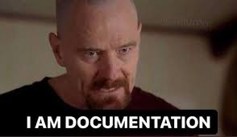

Many times, we push documentation to the back of our backlog, but it’s something very important for every developer.

## Table of contents

## Document Document Document...

Today, I want to talk to you about a topic that, although it may sometimes seem secondary, is fundamental in the life of any developer: writing documentation.

### Documenting for others?

Documenting is taking care of yourself.
When you're just starting out as a developer, it's easy to underestimate the importance of leaving behind good documentation. After all, at that moment, the code is fresh in your mind, and everything makes sense. (A great coworker and mentor I once had used to say, "You're seeing the Matrix"). However, I assure you that in a few weeks, or months, when you return to that project, you'll be searching for explanations and culprits... (you might want to check who made that commit first). And if you didn't document it, you'll probably spend more time trying to remember what it did and why you did it that way.
I like to think that documentation is like leaving yourself a map to avoid getting lost in the maze you created. And not just that, it’s also a way of showing professionalism. Well-documented code is code that facilitates teamwork and ensures the continuity of a project. Think of the person who will pick up your work in the future (which might be you). They’ll be grateful to find a clear and well-structured guide.

### Learning the hard way

Recently, I faced a situation that clearly illustrates what I’m trying to tell you. I had to integrate an external API into our backend for a project. Something that, in theory, shouldn't have been complicated. However, after the meeting with the provider, they shared the "documentation" with us, and honestly, I would have preferred if they hadn't given us anything at all. The little that was there was incomplete, deprecated, or had errors. Endpoints that didn’t work, accounts without access, you name it...
The result was that what should have been a few days' work turned into weeks of frustration and constant testing. And all because the documentation wasn't up to the standards one would expect.

The worst part is that I had just finished working on another project where I was exposing an API, and I had made sure to document everything thoroughly: clear examples, error handling, details on each endpoint, and even a test server to make life easier for others. So, my expectations were high, but I found myself facing a very different reality.

### Why document properly?

This experience taught me several key lessons:

- Documenting from the start saves time and headaches, not only for you but for anyone who has to interact with your code in the future.
- Empathy is fundamental in development. Thinking about how others will use your code or API helps you create more complete and accessible solutions.
- Don’t assume others will do it for you. If you work in a team, leaving good documentation is a sign of respect and professionalism. And if you work alone, it’s an investment in your future.
- If you're in the early years of your career as a developer, your code will improve a lot month by month, and it’ll be much easier to understand why you did what you did a few months ago.

Clearly, documenting isn't the most exciting part of development, but it’s crucial.
The first boss I had as a developer (to whom I owe much of what I am today) documented absolutely everything, and it's something I learned to do almost automatically. Over time, you start trimming and improving, but it’s always better to have too much documentation than not enough...
So, the next time you’re working on a project, remember that documenting isn’t just an extra. It’s a fundamental part of your job, and doing it well makes all the difference.
