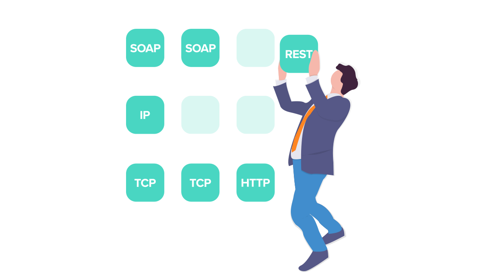

Many times we hear the term API, but do we really know what it means?

## Table of contents

## What is an **API**?

API stands for Application Programming Interface, and something we can already infer from its name. But to be more accurate "APIs are mechanisms that enable two software components to communicate with each other using a set of definitions and protocols."

APIs work by sharing data between applications, systems, and devices. This happens through a request and response cycle. A user initiates a request for data by interacting with an application. The request is sent to the API, which retrieves the data and returns it to the user.

In order to better understand this process, it can be useful to think of APIs like restaurants. In this metaphor, the customer is like the user, who tells the waiter what she wants. The waiter is like an API, receiving the customer's order and translating it into easy-to-follow instructions for the kitchen—sometimes using specific codes or abbreviations that the kitchen staff will recognize. The kitchen staff is like the API server because it creates the order according to the customer's specifications and gives it to the waiter, who then delivers it to the customer.

## Types of APIs

There are many different types of APIs and ways to categorize them. For instance, you can categorize APIs by who has access to them. This organizational framework includes:

- **Private APIs:** Private APIs, also known as internal APIs, are used to connect different software components within a single organization, and they are not available for third-party use. For instance, a social media application might have a private API that handles the login workflow, another private API that handles the feed, and yet another private API that facilitates communication between users. Some applications may include dozens or even hundreds of private APIs.
- **Public APIs:** Public APIs provide public access to an organization's data, functionality, or services, which third-party developers can integrate into their own applications. Some public APIs are available for free, while others are offered as billable products. For instance, an e-commerce application may incorporate a public payment API, such as Stripe, to handle payment processing without having to build that functionality from scratch.
- **Partner APIs:** Partner APIs enable two or more companies to share data or functionality in order to collaborate on a project. They are not available to the general public and therefore leverage authentication mechanisms to ensure they are only used by authorized partners.

You can also categorize APIs according to their architectural style, of which there are many. The most frequently used architectural styles are:

- **REST:** As discussed above, REST is the most popular API architecture for transferring data over the internet. In a RESTful context, resources are accessible via endpoints, and operations are performed on those resources with standard HTTP methods such as GET, POST, PUT, and DELETE.
- **SOAP:** SOAP, which stands for Simple Object Access Protocol, uses XML to transfer highly structured messages between a client and server. SOAP is often used in enterprise environments or legacy systems, and while it includes advanced security features, it can be slower than other API architectures.
- **GraphQL:** GraphQL is an open source query language that enables clients to interact with a single API endpoint to retrieve the exact data they need, without chaining multiple requests together. This approach reduces the number of round trips between the client and server, which can be useful for applications that may run on slow or unreliable network connections.
- **Webhooks:** Webhooks are used to implement event-driven architectures, in which requests are automatically sent in response to event-based triggers. For instance, when a specific event occurs in an application, such as a payment being made, the application can send an HTTP request to a pre-configured webhook URL with the relevant event data in the request payload. The system that receives the webhook can then process the event and take the appropriate action.
- **gRPC:** RPC stands for Remote Procedure Call, and gRPC APIs were originated by Google. In gRPC architectures, a client can call on a server as if it were a local object, which makes it easier for distributed applications and systems to communicate with one another.

## API use cases

APIs are extremely versatile, and they support a wide range of use cases that includes:

- Integrating with internal and external systems
  One of the most common reasons developers turn to APIs is to integrate one system with another. For instance, you can use an API to integrate your customer relationship management (CRM) system with your marketing automation system, which would allow you to automatically send a marketing email when a sales representative adds a new prospective customer to the CRM.

- Adding or enhancing functionality
  APIs let you incorporate additional functionality into your application, which can improve your customers' experience. For instance, if you're working on a food delivery application, you might incorporate a third-party mapping API to let users track their order while it's en route.

- Connecting IoT devices
  APIs are essential to the Internet of Things (IoT) ecosystem, which includes devices such as smart watches, fitness trackers, doorbells, and home appliances. Without APIs, these devices would not be able to connect to the cloud—or to one another—which would render them useless.

- Creating more scalable systems
  APIs are used to implement microservice-based architectures, in which applications are built as a collection of small services that communicate with one another through private APIs. Microservices are managed, deployed, and provisioned independently of one another, which enables teams to scale their systems in a reliable yet cost-efficient way.

- Reducing costs
  APIs help organizations reduce operational costs by automating time-intensive tasks, such as sending emails, pulling reports, and sharing data between systems. They can also reduce development costs by enabling teams to reuse existing functionality, instead of reinventing the wheel.

- Improving organizational security and governance
  APIs power many workflows that are essential for organizational security. For instance, single sign-on (SSO), which enables users to use one username and password for multiple systems, is made possible by APIs. APIs are also used to enforce and automate corporate governance rules and policies, such as a requirement that expenses be approved before employees are reimbursed.
